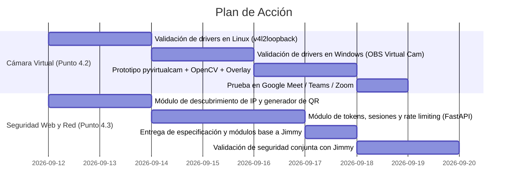

# Plan de Integración Técnica — (Seguridad, Redes y Sistemas)

> **Proyecto:** HandTalk — Traductor de Lenguaje de Señas Personalizado  
> **Alcance:** Resolución del Punto 4.2 de `PLAN_DE_TRABAJO_EQUIPO.md` (Cámara Virtual) y Especificación de Seguridad / Red para el Visor Web (Punto 4.3 / `PLAN_JIMMY.md`).  
> **Estado:** Propuesta de Arquitectura y Plan de Acción (Fase de Diseño).

---

## 1. Introducción y Objetivos del Plan

Este documento formaliza la propuesta técnica y el plan de acción estructurado asignado a mi dentro del equipo HandTalk, articulando las dos responsabilidades fundamentales encomendadas:

1. **Investigación de viabilidad e integración de la Cámara Virtual (`pyvirtualcam`)**: Resolver técnica y operativamente el punto 4.2 de `PLAN_DE_TRABAJO_EQUIPO.md` en entornos **Linux** y **Windows**, garantizando que el traductor pueda emitir video con subtítulos a Google Meet, Zoom y Teams sin acoplarse ni degradar el rendimiento del motor principal.
2. **Propuesta del esquema de seguridad y arquitectura de red del Visor Web (`FastAPI`)**: Diseñar la infraestructura, topología de red, mecanismo de autenticación vía Código QR, protección contra ataques (Fuerza Bruta, XSS, Inyecciones) y headers de seguridad para el servidor web que implementará Jimmy, **garantizando de forma estricta que la computadora host no pierda conexión a Internet**.

---

## 2. Investigación de Viabilidad: Cámara Virtual (`pyvirtualcam`) — Punto 4.2

### 2.1 Principio Operativo y Flujo de Video
`pyvirtualcam` actúa como un puente entre los frames procesados por OpenCV en Python y el subsistema de captura de video del sistema operativo.
El flujo de datos se establece de forma desacoplada:
1. OpenCV captura el frame crudo de la webcam real (`numpy.ndarray` en formato BGR).
2. MediaPipe extrae los landmarks y el clasificador infiere la seña.
3. El sistema de suavizado confirma la seña y se dibuja el banner/subtítulo sobre el frame con OpenCV.
4. **Conversión obligatoria**: OpenCV maneja `BGR`, mientras que `pyvirtualcam` exige `RGB` (o `RGBA`). Se realiza la conversión de bajo costo: `cv2.cvtColor(frame, cv2.COLOR_BGR2RGB)`.
5. El frame se publica en el dispositivo virtual (`cam.send(frame_rgb)`) y se sincroniza la tasa de refresco (`cam.sleep_until_next_frame()`).

```
[Webcam Física] ──► [OpenCV: BGR] ──► [MediaPipe + Modelo ML]
                           │                     │
                           ▼                     ▼
                  [Dibujado de Overlay] ◄── [Palabra Confirmada]
                           │
                 (Conversión BGR-►RGB)
                           │
                           ▼
                 [pyvirtualcam.Camera]
                           │
       ┌───────────────────┴───────────────────┐
       ▼                                       ▼
 [Linux: v4l2loopback]              [Windows: OBS Virtual Cam]
       │                                       │
       └───────────────────┬───────────────────┘
                           ▼
          [Google Meet / Zoom / MS Teams]
```

---

### 2.2 Viabilidad en Linux

#### A. Driver y Requisitos del Sistema
* **Módulo de Kernel:** `v4l2loopback` (Video4Linux2 loopback device).
* **Paquete del sistema:** `v4l2loopback-dkms` y utilitarios `v4l2-utils`.
* **Dispositivo generado:** `/dev/videoX` (por ejemplo `/dev/video10`).

#### B. Parámetros Críticos de Configuración
Para que aplicaciones de videollamada basadas en Chromium/Electron (Google Meet en Chrome/Edge, Teams Desktop, Discord) reconozcan la cámara virtual como un dispositivo de entrada válido y no como una salida, **es imperativo inicializar el módulo con `exclusive_caps=1`**:
```bash
sudo modprobe v4l2loopback devices=1 video_nr=10 card_label="HandTalk Virtual Cam" exclusive_caps=1
```

#### C. Permisos y Grupos de Usuario
* El usuario de Linux debe tener permisos de lectura/escritura en el dispositivo de video sin requerir privilegios `root` en tiempo de ejecución.
* Requisito: Pertenecer al grupo `video`:
  ```bash
  sudo usermod -aG video $USER
  ```

#### D. Automatización y Persistencia
Para evitar que el usuario tenga que ejecutar comandos manuales en cada reinicio:
* Archivo `/etc/modules-load.d/v4l2loopback.conf` conteniendo `v4l2loopback`.
* Archivo `/etc/modprobe.d/v4l2loopback.conf` conteniendo:
  `options v4l2loopback devices=1 video_nr=10 card_label="HandTalk Virtual Cam" exclusive_caps=1`.

#### E. Evaluación de Riesgos y Limitaciones en Linux
* **Secure Boot:** En distribuciones con UEFI Secure Boot activo (Ubuntu/Fedora), los módulos de kernel compilados con DKMS requieren una clave MOK (*Machine Owner Key*) firmada. Se debe documentar el procedimiento o verificar el estado de Secure Boot con `mokutil --sb-state`.
* **Dependencia nativa:** Requiere instalación a nivel de sistema (`apt`/`dnf`/`pacman`), no es instalable únicamente vía `pip`.

---

### 2.3 Viabilidad en Windows

#### A. Driver y Requisitos del Sistema
* **Backend Recomendado:** **OBS Virtual Camera** (DirectShow filter).
* **Alternativa Liviana:** **Unity Capture** (`UnityCaptureFilter.dll`).
* `pyvirtualcam` detecta automáticamente el runtime de OBS si está instalado en el sistema.

#### B. Método de Instalación y Registro
1. **Opción A (Recomendada para el equipo):** Tener instalado **OBS Studio** (versión 26.0 o superior), el cual registra nativamente `obs-virtualcam-module64.dll` en el registro de Windows.
2. **Opción B (Instalación mínima independiente):** Registrar únicamente el plugin de cámara virtual de OBS mediante un script de instalación por lotes ejecutando `regsvr32` sobre la biblioteca DLL correspondiente de 64 bits.

#### C. Compatibilidad de Aplicaciones en Windows
* **Zoom (Desktop Client):** Alta compatibilidad nativa mediante DirectShow.
* **Google Meet (Chrome/Firefox/Edge):** Reconocimiento inmediato como cámara web estándar.
* **Microsoft Teams:** Requiere compatibilidad con firmas de drivers de Windows; OBS Virtual Camera está certificado y funciona sin conflicto.

#### D. Evaluación de Riesgos y Limitaciones en Windows
* **Arquitectura de bits:** `python` y la DLL de la cámara virtual deben coincidir en arquitectura (ambos 64-bit). En Python de 32-bit `pyvirtualcam` fallará.
* **Permisos de Administrador:** Se requieren permisos de elevación (UAC) únicamente durante el registro inicial del driver en Windows, pero no para ejecutar HandTalk.

---

### 2.4 Rendimiento, Latencia y Sincronización
* **Resolución estándar:** Fijar 1280x720 (720p) o 640x480 (VGA) a 30 FPS. Transmitir en 1080p introduce costo de conversión de color innecesario que compite con la inferencia de MediaPipe.
* **Desacoplamiento de hilos:** El envío de frames a la cámara virtual no debe realizarse de forma síncrona bloqueante en el hilo de inferencia principal. Si `pyvirtualcam` experimenta contención de buffer, la detección de landmarks no debe sufrir caídas de frames.

---

### 2.5 Estrategia de Tolerancia a Fallos (Graceful Degradation)
La cámara virtual es una funcionalidad **no bloqueante**:
* Si el driver no existe en el sistema (`v4l2loopback` no cargado o OBS Virtual Cam no instalada), HandTalk debe capturar la excepción (`pyvirtualcam.CameraNotFoundError` o `RuntimeError`).
* HandTalk continuará su ejecución normal mostrando la traducción en la GUI de escritorio, registrando una advertencia amigable en consola/logs indicando los pasos para activar la cámara virtual.
* Se proveerá un switch/toggle en la GUI principal para encender/apagar la salida virtual a demanda.

---

## 3. Arquitectura de Red y Conectividad del Host (Punto 4.3)

### 3.1 Garantía de Conectividad a Internet en el Host

#### A. Diagnóstico del Problema: ¿Por qué los hosts pierden Internet al servir portales locales?
* Un error común al montar un "servidor local para celulares" es habilitar un modo *Ad-Hoc* o crear un *SoftAP* (Punto de Acceso Wi-Fi virtual) en la misma tarjeta inalámbrica de la computadora. En muchos chipsets Wi-Fi, operar en modo concurrente (estación conectada al router + punto de acceso) no está soportado por el hardware, provocando que la interfaz Wi-Fi se desconecte de la red doméstica y la computadora pierda acceso a Internet.
* Otro fallo común ocurre cuando se altera la tabla de rutas del sistema operativo (`default gateway`), haciendo que el tráfico saliente intente rutearse por una interfaz virtual sin salida a la WAN.

#### B. Arquitectura de Red Adoptada: Conexión sobre Infraestructura LAN Común
Para garantizar al 100% que el host **no pierda Internet**, se adopta la topología de **LAN Compartida sobre Router / Gateway Existente**:
1. La computadora host permanece conectada normalmente a su red Wi-Fi o Ethernet de siempre (con acceso a Internet intacto y tabla de ruteo sin tocar).
2. El dispositivo móvil (celular) se conecta a esa misma red Wi-Fi.
3. El host levanta el servidor FastAPI vinculándose a su dirección IP privada asignada dentro de la LAN (ejemplo: `192.168.1.45`).
4. **Cero impacto en WAN:** El servidor web únicamente atiende peticiones en la capa local (puerto `8000`), sin alterar gateways, DNS ni interfaces de red activas.

```
                  ┌───────────────────────────────┐
                  │    Router Wi-Fi Doméstico     │ ◄─── Conexión a Internet
                  │      (Gateway: 192.168.1.1)   │       (Intacta en todo momento)
                  └───────┬───────────────┬───────┘
                          │               │
            [Wi-Fi / LAN] │               │ [Wi-Fi]
                          ▼               ▼
            ┌───────────────────────┐   ┌────────────────────────┐
            │   Host PC (HandTalk)  │   │  Smartphone (Visor)    │
            │   IP: 192.168.1.45    │   │  IP: 192.168.1.80      │
            │   FastAPI: Puerto 8000│   │  Navegador Web         │
            └───────────────────────┘   └────────────────────────┘
```

#### C. Detección Dinámica y Robusta de la IP Local
Para no forzar al usuario a buscar su IP en la terminal (`ipconfig` o `ip addr`), se implementa una rutina de descubrimiento dinámico que identifica la interfaz que tiene salida a la ruta predeterminada sin enviar paquetes a internet:
* Abre un socket UDP saliente hacia una dirección externa confiable (ej. `8.8.8.8:80`).
* Lee la dirección IP asignada a ese socket mediante `socket.getsockname()[0]`.
* Esta IP local es la que se usará para construir la URL del Código QR y enlazar el servidor.

#### D. Política de Binding y Firewall
* **Host Binding:** `0.0.0.0` o la IP de la interfaz LAN activa detectada.
* **Puerto:** `8000` (configurable si está ocupado).
* **Firewall Host:**
  * En Windows: Se documentará la apertura de regla de entrada en el Firewall de Windows para el puerto `8000` restringido al perfil "Red Privada".
  * En Linux: Regla básica en `ufw`: `sudo ufw allow in proto tcp from 192.168.0.0/16 to any port 8000`.

---

## 4. Esquema de Seguridad Integral para el Servidor Web (FastAPI)

Dado que el servidor FastAPI estará accesible para cualquier equipo en la misma red Wi-Fi (como redes compartidas o de oficina), se implementa una arquitectura de seguridad por capas antes de que Jimmy escriba el servidor base.

```
                      PETICIÓN HTTP ENTRANTE (Móvil)
                                    │
                                    ▼
       ┌────────────────────────────────────────────────────────┐
       │ 1. Middleware de Cabeceras de Seguridad                │
       │    (CSP, X-Content-Type-Options, X-Frame-Options)      │
       └────────────────────────────┬───────────────────────────┘
                                    │
                                    ▼
       ┌────────────────────────────────────────────────────────┐
       │ 2. Rate Limiting Middleware (slowapi)                  │
       │    (Protección contra escaneo y fuerza bruta)          │
       └────────────────────────────┬───────────────────────────┘
                                    │
                                    ▼
       ┌────────────────────────────────────────────────────────┐
       │ 3. Capa de Autenticación / Handshake                   │
       │    - Token efímero vía Código QR                       │
       │    - O validación de PIN de 6 dígitos                  │
       │    - Emisión de Cookie de Sesión HttpOnly / SameSite   │
       └────────────────────────────┬───────────────────────────┘
                                    │
                                    ▼
       ┌────────────────────────────────────────────────────────┐
       │ 4. Validación de Esquemas y Sanitización (Pydantic)    │
       │    (Escape de HTML en palabras confirmadas)            │
       └────────────────────────────┬───────────────────────────┘
                                    │
                                    ▼
         [Endpoint Protegido / WebSocket de Traducción en Vivo]
```

---

### 4.1 Autenticación y Control de Acceso Legítimo

#### A. Generación de Token Efímero de Sesión
1. Al pulsar "Iniciar Visor Web" en HandTalk, el sistema genera:
   * Un `SESSION_TOKEN` criptográficamente seguro de 32 bytes hexadecimales (`secrets.token_urlsafe(32)`).
   * Un `PIN` numérico alternativo de 6 dígitos aleatorios (`secrets.randbelow`).
2. Estos credenciales viven en memoria durante la sesión del traductor (con un tiempo de vida configurable, ej. 2 horas).

#### B. Redirección y Acceso Automático mediante Código QR
* El código QR generado contiene la URL absoluta con el token en el query parameter:  
  `http://<IP_HOST>:8000/auth/qr?token=<SESSION_TOKEN>`
* **Flujo transparente:**
  1. El usuario escanea el QR con la cámara de su celular.
  2. El navegador móvil abre la URL.
  3. El endpoint `/auth/qr` de FastAPI valida el token:
     * Si es válido: Genera una cookie de sesión cifrada/firmada (`session_id`), con banderas `HttpOnly`, `SameSite=Lax`, y redirige inmediatamente (`HTTP 303`) a `/viewer`.
     * Si es inválido: Responde `HTTP 403 Forbidden` con una página de acceso denegado sin exponer detalles del sistema.
* **Acceso Manual con PIN (Respaldo si falla la cámara del móvil):**
  * Si el usuario accede directamente a `http://<IP_HOST>:8000/`, es redirigido a `/login`.
  * La pantalla de login solicita el PIN de 6 dígitos mostrado en la ventana de HandTalk.

#### C. Límite de Sesiones Concurrentes
Para evitar que múltiples dispositivos en la red consuman recursos o lean la traducción sin permiso:
* Se define un límite estricto: `MAX_ACTIVE_SESSIONS = 2` (el teléfono principal y un dispositivo secundario opcional).
* Cualquier intento de login adicional es rechazado hasta que se cierre una sesión previa.

---

### 4.2 Rate Limiting (Prevención de DoS y Fuerza Bruta)

* **Tecnología:** `slowapi` (extensión de `limits` diseñada para FastAPI) o middleware ASGI en memoria por IP cliente.
* **Políticas de límite:**
  * `POST /login` y `GET /auth/qr`: **5 intentos por minuto por IP**. Si se supera, se bloquea temporalmente devolviendo `HTTP 429 Too Many Requests` y cabecera `Retry-After: 60`.
  * Endpoints estáticos (`/`, `/viewer`, `/static/*`): **60 peticiones por minuto por IP**.
  * Endpoint WebSocket (`/ws/translations`): **3 intentos de conexión por minuto por IP**.

---

### 4.3 Sanitización de Entradas y Validación Estricta

* **Modelos de Entrada con Pydantic:**
  * Toda entrada del usuario (ej. envío de PIN) se procesa mediante esquemas con validación por expresiones regulares:
    `pin: constr(regex=r"^\d{6}$")`.
* **Sanitización del Payload de Traducción:**
  * Aunque las palabras provienen del modelo de Machine Learning (`realtime_translator.py`), antes de inyectarse en el canal WebSocket o REST, se aplica sanitización estricta mediante `html.escape(word)` para garantizar la neutralización de caracteres como `<`, `>`, `&`, `"`, `'`.

---

### 4.4 Protección contra Ataques XSS y Cabeceras de Seguridad (HTTP Hardening)

Se establece un Middleware global de seguridad en FastAPI que inyecta en cada respuesta HTTP las siguientes cabeceras:

1. **Content-Security-Policy (CSP):**
   ```http
   Content-Security-Policy: default-src 'self'; script-src 'self'; style-src 'self' 'unsafe-inline'; img-src 'self' data:; connect-src 'self' ws: wss:; frame-ancestors 'none'; object-src 'none'; base-uri 'self';
   ```
   * Evita la carga de scripts de orígenes desconocidos.
   * Restringe la conexión de WebSockets únicamente al propio host (`'self' ws:`).
   * Impide ataques de Clickjacking (`frame-ancestors 'none'`).

2. **Cabeceras Adicionales de Blindaje:**
   * `X-Content-Type-Options: nosniff`: Evita que el navegador interprete archivos con tipos MIME incorrectos (MIME sniffing).
   * `X-Frame-Options: DENY`: Refuerzo anti-embebido en iframes.
   * `X-XSS-Protection: 1; mode=block`: Filtro XSS legacy para navegadores antiguos.
   * `Referrer-Policy: strict-origin-when-cross-origin`: Minimiza fuga de información de URL.

3. **Directiva para el Frontend (Wilfredo + Jimmy):**
   * En el código JavaScript del cliente móvil, la palabra confirmada recibida por WebSocket debe insertarse en el DOM utilizando **exclusivamente `element.textContent = data.word`**, prohibiendo terminantemente el uso de `element.innerHTML`.

---

## 5. Especificación Técnica y Contrato de Entrega para Jimmy

Para que Jimmy pueda implementar el backend del servidor sin discrepancias, te proveo la definición exacta de la estructura y los contratos:

### 5.1 Estructura Modular Sugerida
```
HandTalk/
├── inicio/
│   ├── ... (módulos existentes)
│   ├── virtual_cam.py            <-- [Jason] Manejo de pyvirtualcam y fallback
│   ├── web_security/             <-- [Jason] Capa de seguridad y red
│   │   ├── __init__.py
│   │   ├── auth.py               <-- Gestión de tokens, PIN y sesiones
│   │   ├── rate_limiter.py       <-- Configuración de slowapi / límites
│   │   ├── security_headers.py   <-- Middleware de cabeceras CSP y hardening
│   │   ├── network_utils.py      <-- Detección de IP LAN y generación de QR
│   ├── web_server.py             <-- [Jimmy] Servidor FastAPI + WebSockets
```

### 5.2 Endpoints a Exponer por Jimmy
| Método | Ruta | Seguridad / Middleware | Descripción |
|---|---|---|---|
| `GET` | `/auth/qr` | Rate Limit (5/m) + Validación Token | Valida token del QR, setea cookie HttpOnly y redirige a `/viewer`. |
| `GET` | `/login` | Rate Limit (10/m) | Sirve la pantalla para ingresar el PIN si no se usó el QR. |
| `POST` | `/login` | Rate Limit (5/m) + Pydantic Schema | Valida el PIN ingresado y genera la cookie de sesión. |
| `GET` | `/viewer` | Requiere Cookie de Sesión Válida | Sirve la página HTML del visor en vivo (diseñada por Wilfredo). |
| `WS` | `/ws/translations` | Requiere Cookie de Sesión Válida en Handshake | Canal WebSocket bidireccional donde se emite la palabra confirmada. |
| `POST`| `/logout` | Sesión activa | Invalida la sesión actual y libera el cupo. |

### 5.3 Integración con el Patrón de Eventos (`EVENTOS.md`)
En `web_server.py`, Jimmy registrará un callback en el motor de traducción:
```python
# Contrato de integración acordado en EVENTOS.md
def on_translation_confirmed(word: str, confidence: float, timestamp: str):
    # 1. Sanitizar payload (html.escape)
    # 2. Reenviar payload a los clientes WebSocket autenticados
    asyncio.run_coroutine_threadsafe(
        broadcast_to_viewers({"word": safe_word, "confidence": confidence, "timestamp": timestamp}),
        server_event_loop
    )
```

### 5.4 Dependencias a Agregar en `requirements.txt`
```text
# Cámara Virtual
pyvirtualcam>=0.11.0

# Servidor Web y Seguridad
fastapi>=0.110.0
uvicorn[standard]>=0.28.0
slowapi>=0.1.9
qrcode[pil]>=7.4.2
pydantic>=2.6.0
```

---

## 6. Plan de Acción Paso a Paso (Roadmap)



### Fase 1: Módulos de Red y Ciberseguridad (En paralelo con Jimmy)
1. **Paso 1.1:** Implementar `network_utils.py` para resolver la IP LAN del host sin afectar el gateway de Internet y generar la imagen del código QR con `qrcode`.
2. **Paso 1.2:** Crear los módulos de seguridad (`auth.py`, `security_headers.py`, `rate_limiter.py`) y entregárselos a Jimmy como middleware empaquetado para su `web_server.py`.
3. **Paso 1.3:** Coordinar con Wilfredo para definir el formato de visualización del código QR en el menú principal o modal de HandTalk.

### Fase 2: Investigación Práctica de `pyvirtualcam` (Linux y Windows)
1. **Paso 2.1 (Entorno Linux):** Instalar `v4l2loopback-dkms`, probar la carga del módulo con `exclusive_caps=1`, y validar que Google Meet en Chromium detecte `/dev/video10`.
2. **Paso 2.2 (Entorno Windows):** Verificar la detección del driver de OBS Virtual Camera en Windows mediante un script de validación mínimo con `pyvirtualcam`.
3. **Paso 2.3:** Construir la clase envoltorio `VirtualCamManager` con manejo de excepciones y fallback seguro para que la app no crashee si falta el driver.

### Fase 3: Pruebas de Integración y Validación de Seguridad
1. **Paso 3.1:** Pruebas de estrés y penetración básica sobre el servidor web de Jimmy:
   * Verificar que peticiones sin token/cookie reciban `403 Forbidden`.
   * Verificar que escaneos de fuerza bruta activen el `HTTP 429 Too Many Requests`.
   * Verificar que la inyección de etiquetas `<script>` o HTML malicioso en el canal de traducción resulte neutralizada y escapada.
2. **Paso 3.2:** Validación de la cámara virtual en videollamada real (Google Meet / Teams) mostrando la seña traducida en el overlay a 30 FPS.

---

## 7. Matriz de Riesgos y Mitigaciones

| Riesgo Identificado | Impacto | Probabilidad | Estrategia de Mitigación |
|---|---|---|---|
| El usuario tiene Secure Boot activado en Linux y bloquea `v4l2loopback`. | Alto | Media | Capturar la excepción en tiempo de carga, documentar la firma MOK y degradar la app a modo solo-escritorio sin congelarse. |
| El host pierde conexión Wi-Fi por intentar levantar un AP independiente. | Crítico | Baja (con este plan) | Se prohíbe el modo SoftAP. Se utiliza exclusivamente la infraestructura LAN existente del router. |
| Ataque de fuerza bruta al PIN de acceso en red local abierta. | Medio | Media | Rate limit estricto con `slowapi` (5 intentos por minuto por IP) y bloqueo temporal tras fallos reiterados. |
| La conversión de color y envío a `pyvirtualcam` ralentiza el clasificador. | Medio | Baja | Trabajar a resolución 720p/VGA, realizar la conversión `cvtColor` solo si hay suscriptores y enviar frames en hilo secundario. |
| Dispositivos móviles viejos no soportan lectura de QR nativa. | Bajo | Baja | Proveer la URL legible y el PIN de 6 dígitos visible en pantalla como método alternativo de login. |

---

## 8. Criterios de Aceptación

- [ ] **Cámara Virtual Operativa:** `pyvirtualcam` envía video con texto sobrepuesto a Google Meet o Teams en Linux (`v4l2loopback`) y Windows (`OBS Virtual Cam`) a un mínimo de 25-30 FPS.
- [ ] **Tolerancia a Fallos:** Si el driver de cámara virtual no está presente, HandTalk inicia normalmente informando la situación sin arrojar excepciones no controladas.
- [ ] **Acceso Web Protegido:** Ningún dispositivo puede ver la traducción en `/viewer` sin haber escaneado el QR o ingresado el PIN válido.
- [ ] **Rate Limiting Verificado:** Un script de peticiones concurrentes recibe código HTTP 429 tras 5 intentos fallidos en `/login`.
- [ ] **Protección XSS Comprobada:** Las cabeceras CSP están presentes en todas las respuestas HTTP y el payload de traducción no interpreta tags HTML.
- [ ] **Conectividad Continua:** La computadora host mantiene acceso ininterrumpido a Internet durante y después de servir el visor web a los dispositivos móviles.
